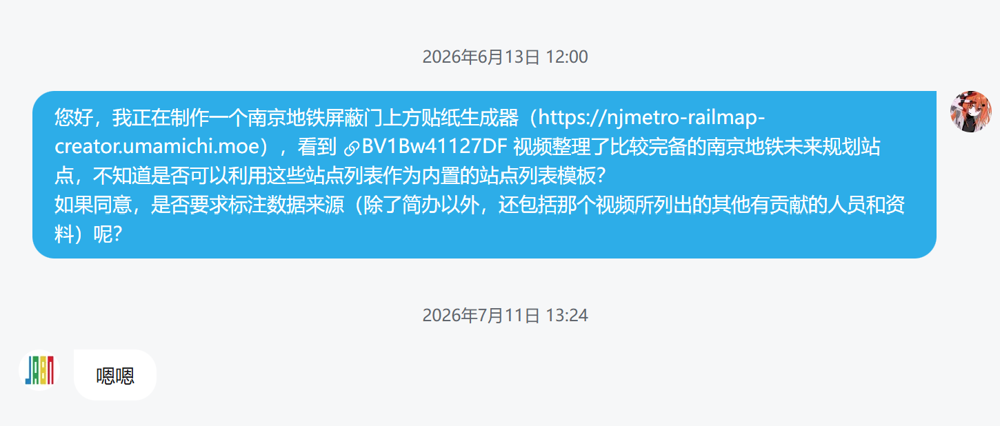

# 简办动态演示线网：数据来源与致谢

> **重要：** **处于在建或规划研究阶段的未开通线路，站点设置、线路走向等具有不确定性；请以南京地铁官方最终公布为准。**

「按线路填充站点」中的 **简办动态演示线网** 依据 B 站「简办动态演示」[BV1Bw41127DF](https://www.bilibili.com/video/BV1Bw41127DF) 录入；其整理以建设规划、环评公示等**互联网公开信息**为据。

| 项 | 内容 |
| --- | --- |
| UP | 简办动态演示 |
| 视频 | [BV1Bw41127DF](https://www.bilibili.com/video/BV1Bw41127DF) |
| 授权 | 经私信确认可用于内置模板并标注来源（截图见下） |

## 致谢（视频简介照录）

> 感谢@纵横金陵、@萝铁杂谈、@油坊桥上的灯、@北落师门b0125等对数据表、线路图等内容作出建议及修正意见，以及私信或评论提供信息的网友。

## 授权截图

## 视频片尾参考文件与说明

以下为视频片尾原文转录：

> 参考文件:《南京市城市轨道交通第二期建设规划(2015-2020年)(发改基础〔2015〕959号)》
> 《南京市城市轨道交通第三期建设规划(2023-2028年)》环境影响评价第二次公示
> 《长江三角洲地区多层次轨道交通规划(发改基础〔2021〕811号)》
>
> 内容说明:线路工程文件基于常用地图软件绘制,不代表准确的实际走向;在建及规划车站名称仅为暂定名称,规划新线标识色为虚拟参考色,部分走线未公布,请以市政府或地铁官方最终公布为准。在建线路开通时间仅供参考,同年不分先后。部分数据为粗略统计,不做对比。
>
> (非地铁或短期及受外部因素影响导致的停运,不进行演示)
>
> 数据全部来源于互联网公开信息,不代表官方意见,不能确保时效性及准确性,仅供学习参考。
>
> 著作声明:未经作者授权禁止转载与搬运!(转载包括但不限于录屏、截图、裁剪、二创等形式,禁止用于房地产等商业行为)

本仓库对站点列表的使用已征得作者同意，并按规定标注来源；请勿将模板数据另行未授权转载或商业使用。

## 本仓库备注

- 已开通站名以2026.6现实线网站名为准，未开通站名按视频整理录入。
- **16、18 号线**色 `#FF7900` / `#F77AB4` 为**官方未定标识色**，仅用于简办填充；不计入 `getNjmetroLine*` 自动填色。
- 实现：`src/builtinJianbanLineStations.ts`、`src/jianbanLineColors.ts`。
