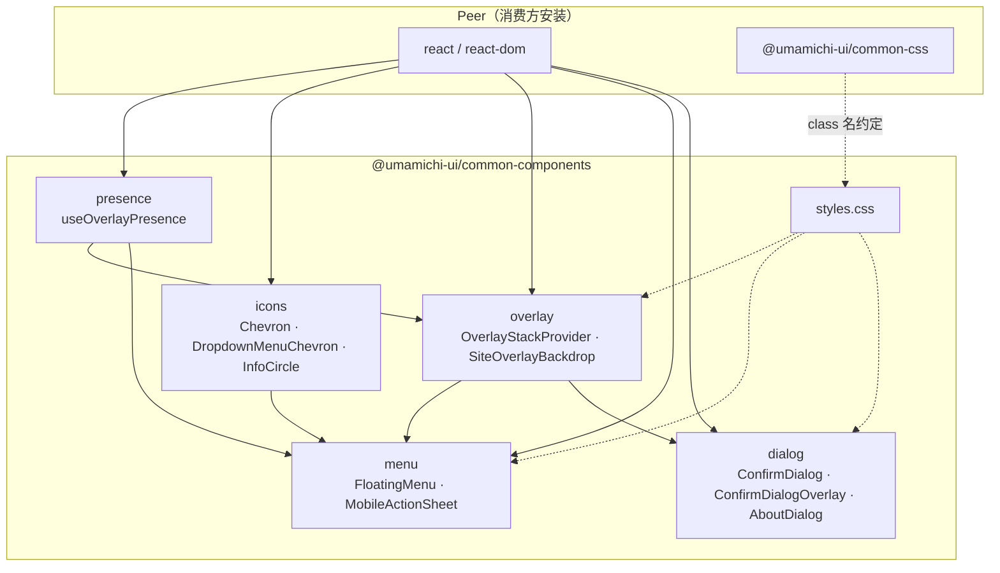

# 聊天记录原文

> 以下文本由 LLM 生成，且未经人工检查，请谨慎对待
>
> 以下内容为 Cursor Agent 根据本对话整理的聊天记录原文；工具调用、终端输出等执行细节已省略为 `[REDACTED]`。
>
> 主题：分析并提取 `@umamichi-ui/common-components`、在桌面创建组件库、`njmetro-railmap-creator` 接入、README 依赖图。
>
> 日期：2026-05-23

---

## 用户

请分析本项目有哪些内容适合提取到 umamichi-ui/common-components 中？（打算新建一个项目）

---

## 助手

（Ask 模式，仅分析、未改代码。）

结合仓库结构和与 `@umamichi-ui/common-css` 的分工，下面是一份**适合抽到 `umamichi-ui/common-components` 的候选清单**（按优先级与边界说明）。

---

### 与现有生态的关系

项目已在 `main.tsx` 引入 `@umamichi-ui/common-css`，弹层壳子（`.confirm-dialog`、按钮、表单等）主要由 **common-css** 提供；本仓库补的是 **React 行为层** 和 **叠层栈**、以及 common-css 未覆盖或需与 JS 联动的样式（如 `styles.css` 里 `784–1004` 行的 overlay / mobile-action-sheet）。

建议分工：

| 包 | 职责 |
|---|---|
| `common-css` | 设计 token、`.confirm-dialog` 外观、按钮、backdrop 毛玻璃等 |
| `common-components`（新建） | Portal、叠层栈、Esc/返回键、进出场动画 hook、可复用 React 组件 |
| 本应用 | 南京地铁业务、Redux、YAML/RMG、贴纸 SVG |

---

### 第一优先级：叠层基础设施（最值得先抽）

这是 CHANGELOG 和 `docs/chat-transcript-undo-autosave-overlay.md` 里反复打磨过的一套，**与业务无关、API 稳定、跨站复用价值最高**。

| 模块 | 路径 | 说明 |
|------|------|------|
| 叠层栈 Context | `src/overlay/OverlayStackProvider.tsx` | z-index、顶层 Esc、与 `history` 联动 |
| 栈类型与 z-index | `src/overlay/overlayStackTypes.ts` | `OVERLAY_Z_BASE` / `computeOverlayZIndex` |
| History 辅助 | `src/overlay/overlayHistory.ts` | `pushOverlayHistoryState`、`isOverlayHistoryState` |
| 单条叠层注册 | `src/overlay/useOverlayStackEntry.ts` | 与 Provider 配合 |
| 统一 Backdrop | `src/overlay/SiteOverlayBackdrop.tsx` | Portal + 对齐（center/top/bottom）+ 仅顶层可点背景 |
| 薄封装 | `src/components/ConfirmDialogOverlay.tsx` | 可保留为 `ConfirmDialogOverlay` 或并入 `SiteOverlayBackdrop` 文档示例 |
| 进出场 hook | `src/hooks/useOverlayPresence.ts` | `mounted` / `isOpen` / `withOverlayOpen` / `mergeOverlayRefs`；注释已写明依赖 common-css 的 `--transition-overlay` |
| 配套 CSS | `styles.css` 中 `.site-overlay-backdrop*`、`.site-overlay-backdrop-inactive`、打开动画选择器 | 可迁到 common-components 的 `overlay.css`，由包文档要求 peer 依赖 common-css |

**留在应用内**：`src/overlay/overlayIds.ts`（各站点的 overlay id 常量）。

**使用方式（抽完后）**：应用只包一层 `<OverlayStackProvider>`，各对话框传 `overlayId` + `open` + `onDismiss` 即可——与当前 `main.tsx` 一致。

---

### 第二优先级：移动端与菜单类 UI

#### `MobileActionSheet`

- 文件：`src/components/MobileActionSheet.tsx`
- 依赖：`SiteOverlayBackdrop`、`ChevronLeftIcon` / `ChevronRightIcon`
- 特性：底部滑入、子菜单横向滑动、separator / disabled，**完全通用**
- 需一并迁移：`styles.css` 中 `.mobile-action-sheet*`（约 833–1004 行）

#### 浮动下拉菜单（从 YAML 菜单中抽象）

`StationYamlIoMenus.tsx` 里有一半是**可复用框架**：

- `computeFloatingMenuGeometry`（视口定位、翻转、maxHeight）
- `useYamlIoMenuGeometry` → 可改名为 `useFloatingMenuGeometry`
- 模式：`useOverlayPresence` + `createPortal` + 点击外部关闭 + Escape（capture）

**建议抽成**：`DropdownMenu` / `FloatingMenu`（`trigger` + `items` 或 `children`），保留 `triggerVariant: 'icon' | 'labeled'`。

**留在应用内**：`StationYamlImportMenu` / `StationYamlExportMenu`（文案、RMG、YAML 逻辑）。

#### 小图标组件

| 组件 | 通用性 |
|------|--------|
| `ChevronIcons.tsx` | 高 |
| `DropdownMenuChevron.tsx` | 高 |
| `InfoCircleIcon.tsx` | 高 |
| `topbar/FileCommandIcons.tsx`（新建/导入/导出） | 中——可作 `FileIcons` 或 `ToolbarIcons` 子集 |

---

### 第三优先级：对话框「壳」与模板（内容仍由应用注入）

common-css 已有 `.confirm-dialog` 结构类；common-components 可提供 **带叠层栈的 React 壳**：

#### 通用确认框布局

应用中大量重复模式（`App.tsx` 内多个确认框、`BadgeDownloadDialog` 等）：

```tsx
<ConfirmDialogOverlay>
  <div className="confirm-dialog" role="dialog">
    <h2 className="confirm-dialog-title">…</h2>
    <div className="confirm-dialog-body">…</div>
    <div className="confirm-dialog-actions">…</div>
  </div>
</ConfirmDialogOverlay>
```

可抽：**`ConfirmDialog`**（props：`title`、`children`、`actions`、`overlayId`、`open`、`onDismiss`），减少每个功能重复写 ARIA 与 `stopPropagation`。

#### `AboutDialog` 模板化

`AboutDialog.tsx` 中**壳与版式**通用，**文案与链接**应用传入：

- 可配置：`appName`、`version`、`tagline`、`copyrightYear`、`links[]`、`sections[]`（致谢/反馈）
- 当前文件里的南京地铁、RMG、GitHub URL 留在应用层配置

#### 设置 / 自动保存列表（可选、需抽象存储）

| 模块 | 抽法 |
|------|------|
| `SettingsDialog.tsx` | 抽 **`AutosaveSettingsForm`** 或泛化 **`SettingsDialog`**，字段通过 props/schema 传入 |
| `AutosaveListDialog.tsx` | 抽 **`AutosaveListDialog<TEntry>`**，`readEntries` / `formatEntry` / `onSelect` 由应用注入 |
| `autosaveStorage.ts` | 抽 **`createLocalStorageAutosave<TPayload>({ keys, defaults, clamp })`** |
| `features/autosaveScheduler.ts` | 抽 **`createAutosaveScheduler({ getState, serialize, getSummary })`** |

若短期内只有本应用用自动保存，可**延后**；若 umamichi.moe 上多个编辑器都要，值得一起做。

---

### 第四优先级：Hooks 与轻量工具

| 模块 | 路径 | 说明 |
|------|------|------|
| 预览加载指示 | `hooks/usePreviewLoadingOverlay.ts` | 重渲染超过一帧才显示 loading；适用于任何「重计算预览」 |
| 顶栏断点 | `layout/topbarLayout.ts` | `TOPBAR_COMPACT_MAX_WIDTH_PX` + media query 字符串；可扩展为 `useTopbarCompact()` |
| 离开页保护 | `features/leaveGuard.ts` | 可泛化为 `createLeaveGuard({ hasUnsavedChanges, exempt })`，与 Redux 解耦 |

**主题切换**：逻辑散落在 `App.tsx`（`themeStorageKey`、`localStorage`、`theme-transition-lock`）。若多站统一，可抽 **`useSiteTheme` / `SiteThemeProvider`**，CSS 仍靠 common-css 的 `data-theme`。

---

### 第五优先级：顶栏与布局（偏「站点框架」，视其他项目需求）

`styles.css` 中 `.app-layout`、`.app-topbar*` 与 `App.tsx` 顶栏 JSX 是一套 **SiteFrame 风格**（注释也提到对齐 umamichi.moe）。

可抽但耦合略高：

- **`SiteTopbar`**：`title`、`betaMark?`、`fileCommands`、`actions`、`mobileMoreSheet`
- **`TopbarFileCommands`** 本身太业务（YAML/RMG），只抽 **插槽**：`leftSlot` / `centerSlot` / `rightSlot`

若 `common-components` 定位是「小组件库」而非「整站框架」，顶栏可放到单独的 `@umamichi-ui/site-frame`，或继续放在各应用 + common-css。

---

### 不建议放入 common-components 的内容

这些与南京地铁 / 贴纸生成强绑定，应留在本仓库或 kyuri-metro 专用包：

| 类别 | 示例 |
|------|------|
| 贴纸 / SVG 业务 | `LineIdBadge`、`RouteBadge`、`DirectionBadge`、`CurrentStationBadge`、`BadgeDownload*`、`badgeExport.ts` |
| 站点编辑 | `StationTable`、`StationFormModal`、`builtinOpenedLineStations.ts` |
| 数据与状态 | `generatorSlice`、`store`、`stationListYaml`、`kyuriRmgProtocol`、`njuriRmg*` |
| 配色与字体 | `njmetroLinePalette.ts`、`fontStacks.ts`、`fontSignature.ts` |
| RMG 集成 | `KyuriRmgToolModal`、`config/kyuriRmgIframe.ts` |
| SVG 布局引擎 | `svgPositioning.tsx`（体量大、专用于贴纸组合布局；若多项目要可单独 `@umamichi/svg-positioning`） |
| 文档与素材 | `docs/`、`public/assets/` |

---

### 建议的包结构与发布形态

```text
@umamichi-ui/common-components
├── overlay/          # Provider, SiteOverlayBackdrop, hooks
├── dialog/           # ConfirmDialog, AboutDialog(template)
├── menu/             # FloatingMenu, MobileActionSheet
├── icons/            # Chevron, InfoCircle, FileIcons…
├── hooks/            # usePreviewLoadingOverlay, useSiteTheme?
└── styles/           # overlay.css, mobile-action-sheet.css（peer: common-css）
```

- **peerDependencies**：`react`、`react-dom`、`@umamichi-ui/common-css`
- **不依赖** Redux、yaml、kyuri-metro 包
- `overlayIds` 由各应用自建；库只要求 `overlayId: string` 唯一

---

### 推荐实施顺序（新建仓库时）

1. **叠层栈 + `useOverlayPresence` + `SiteOverlayBackdrop` + 相关 CSS** —— 立刻降低各站重复 portal/history 代码
2. **`ConfirmDialog` 壳 + `MobileActionSheet`** —— 覆盖本应用大多数弹层形态
3. **浮动 `DropdownMenu` + 图标** —— 统一顶栏/表单旁菜单
4. **`AboutDialog` 模板、`usePreviewLoadingOverlay`** —— 按需
5. **自动保存子系统、SiteTopbar** —— 等多应用确认需求后再做

---

### 小结

**最适合进 `common-components` 的**是：已在 common-css 之上实现完整交互的 **叠层系统**、**移动端 ActionSheet**、**浮动下拉菜单框架**、以及 **Confirm/About 对话框壳** 和少量 **通用 hooks/图标**。

**应留在本项目的**是：地铁线路/站点/贴纸生成、RMG/YAML、Redux 状态与导出管线。

若你打算把 `common-components` 做成「仅 headless hooks」还是「hooks + 带 class 的组件」，可以说一下偏好，我可以按那种形态再列一版更具体的导出 API 草案（仍保持 Ask 模式，只给设计不改动代码）。

---

## 用户

请提取叠层基础设施、移动端与菜单类 UI、对话框「壳」与模板
在桌面上创建项目
各个组件之间尽量不耦合

---

## 助手

[REDACTED：在 `C:\Users\Umamichi\Desktop\umamichi-ui\common-components` 创建包结构、`vite` 库模式构建、实现各子模块；`njmetro-railmap-creator` 改为 `file:` 依赖并删除已迁移代码；两端 `npm run build` 通过。]

已在桌面创建 **`C:\Users\Umamichi\Desktop\umamichi-ui\common-components`**，并完成从 `njmetro-railmap-creator` 的提取与接入；两个项目均可成功 `npm run build`。

### 新项目结构（模块解耦）

各子路径可**单独引用**，仅 `dialog` → `overlay`、`menu/MobileActionSheet` → `overlay` 有单向依赖；`FloatingMenu` 只依赖 `presence`，不进入叠层栈。

| 子路径 | 内容 |
|--------|------|
| `@umamichi-ui/common-components/presence` | `useOverlayPresence`、`withOverlayOpen`、`mergeOverlayRefs` |
| `@umamichi-ui/common-components/overlay` | `OverlayStackProvider`、`SiteOverlayBackdrop`、history/z-index |
| `@umamichi-ui/common-components/icons` | Chevron、下拉箭头、Info 图标 |
| `@umamichi-ui/common-components/menu` | `FloatingMenu`、`MobileActionSheet` / `MobileActionSheetContent` |
| `@umamichi-ui/common-components/dialog` | `ConfirmDialog`、`ConfirmDialogOverlay`、`AboutDialog`（模板） |
| `@umamichi-ui/common-components/styles.css` | overlay、action sheet、about 补充样式 |

### 原项目变更

- `package.json` 增加：`"@umamichi-ui/common-components": "file:../umamichi-ui/common-components"`
- `main.tsx` 引入 `styles.css` 与 `OverlayStackProvider`
- YAML 导入/导出菜单改为使用 `FloatingMenu`
- `AboutDialog` 改为传入业务数据的 `AboutDialog` 模板
- 删除已迁移的 overlay / hooks / 组件文件（保留 `overlay/overlayIds.ts`）
- 从 `styles.css` 移除已迁入组件库的重复样式

### 使用方式

```tsx
import '@umamichi-ui/common-css';
import '@umamichi-ui/common-components/styles.css';
import { OverlayStackProvider } from '@umamichi-ui/common-components/overlay';
```

修改组件库后，在 `common-components` 目录执行 `npm run build`，消费方会自动通过 `file:` 链接拿到最新构建。

### 开发命令

```bash
# 组件库
cd C:\Users\Umamichi\Desktop\umamichi-ui\common-components
npm install
npm run build

# 贴纸生成器（已联调）
cd C:\Users\Umamichi\Desktop\njmetro-railmap-creator
npm install
npm run dev
```

若要将包发布到 npm，把 `package.json` 里的 `file:` 依赖改为版本号即可。需要的话我可以再补 `umamichi-ui` 根目录的 workspace 配置（pnpm/npm workspaces）。

---

## 用户

请在 readme 添加依赖图

---

## 助手

已在 `C:\Users\Umamichi\Desktop\umamichi-ui\common-components\README.md` 的「依赖图」一节加入：

- **Mermaid 流程图**：peer 依赖（`react`、`common-css`）与各子模块（`presence` → `overlay` / `menu`，`icons` → `menu`，`overlay` → `dialog` 等）
- **依赖表**：逐条说明模块间关系
- **补充说明**：`menu` 内 `FloatingMenu` 与 `MobileActionSheet` 的差异，以及无库内依赖的叶子 API

在支持 Mermaid 的 Markdown 预览（GitHub、多数 IDE）中可直接渲染该图。

### 附录：`README.md` 依赖图一节（写入时原文）

## 依赖图

模块间仅允许**单向**依赖；`presence` 与 `icons` 为叶子模块，可被任意上层单独引用。



| 从 | 到 | 说明 |
|----|-----|------|
| `presence` | `overlay` | `SiteOverlayBackdrop` 进出场动画 |
| `presence` | `menu` | `FloatingMenu` 面板淡入（不进叠层栈） |
| `icons` | `menu` | 下拉箭头；ActionSheet 子菜单 Chevron |
| `overlay` | `menu` | `MobileActionSheet` 底部 backdrop |
| `overlay` | `dialog` | `ConfirmDialogOverlay` |
| `dialog`（内部） | — | `AboutDialog` → `ConfirmDialog` + `ConfirmDialogOverlay` |

**无库内依赖：** `ConfirmDialog`（纯 markup 壳）、`computeFloatingMenuGeometry`、`OverlayStackProvider` 自身逻辑。

`menu` 子模块内：`FloatingMenu` 只走 `presence`；`MobileActionSheet` 额外依赖 `overlay`。

---

## 用户

请把以上聊天记录原文全文转录进 docs/ 下的 md 文件中

---

## 助手

（即本文档。）
